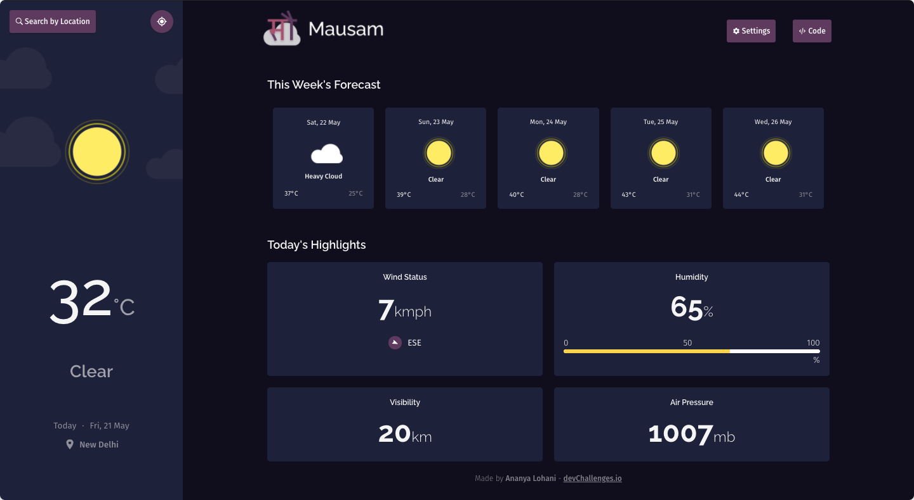

<div align="center">
  
  <h1>Mausam</h1>
</div>

<div align="center">
   Solution for a challenge from  <a href="http://devchallenges.io" target="_blank">devChallenges.io</a>.
</div>

<div align="center">
  <h3>
    <a href="https://mausam.vercel.app">
      Demo
    </a>
    <span> | </span>
    <a href="https://github.com/ananyalohani/Mausam">
      Solution
    </a>
    <span> | </span>
    <a href="https://devchallenges.io/challenges/mM1UIenRhK808W8qmLWv">
      Challenge
    </a>
  </h3>
</div>

## Table of Contents

- [Table of Contents](#table-of-contents)
- [Overview](#overview)
  - [Built With](#built-with)
- [Features](#features)
- [How To Use](#how-to-use)
- [Acknowledgements](#acknowledgements)
- [Contact](#contact)

## Overview



**Mausam** is a web app that fetches the weather data for the next 6 days from the Metaweather API.

- **Where can you see my demo?**

  The demo is live at [mausam.vercel.app](https://mausam.vercel.app/).

- **What was my experience?**

  I took up this project as an opportunity to learn Typescript and TailwindCSS, as well as fetching data from APIs. I was completely new to all these technologies and I truly learnt a lot about them while working on this project.

- **What have I learned/improved?**

  I have learnt refactoring my code better so that it's cleaner and easier to manage and debug. I also learnt about custom hooks in React and how they can be used to fetch data.

- **What would I do differently in hindsight?**

  I realised about halfway into the project that using [Next.js](https://nextjs.org/) would have saved me a lot of time, especially while dealing with CORS issues with the Metaweather API. Oh well, I guess I'll use it in my _Next_ project (sorry).

- **Total time spent:** Approximately 31 hours over 5 days.

### Built With

- [React](https://reactjs.org/)
- [Typescript](https://www.typescriptlang.org/)
- [Tailwind](https://tailwindcss.com/)
- [Metaweather API](https://www.metaweather.com/api/)
- [OpenStreetMap API](https://www.openstreetmap.org/)

## Features

This application was created as a submission to a [DevChallenges](https://devchallenges.io/challenges) challenge. The [challenge](https://devchallenges.io/challenges/mM1UIenRhK808W8qmLWv) was to build an application to complete the given user stories.

The features I implemented are as follows:

- Request for your current location's forecast.
- Request for the forecast of any city.
- Forecast contains today and the next 5 days' weather, along with today's highlights about the wind, humidity, visibility and air pressure.
- Switch between the units of measurement for all entities in Settings.
- Location autocomplete when the user searches for their city, using the OpenStreetMap API.

## How To Use

To clone and run this application, you'll need [Git](https://git-scm.com) and [Node.js](https://nodejs.org/en/download/) (which comes with [npm](http://npmjs.com)) installed on your computer. From your command line:

```bash
# Clone this repository
$ git clone https://github.com/ananyalohani/Mausam.git

# Install dependencies
$ npm install

# Run the app
$ npm start
```

## Acknowledgements

- [SWR](https://swr.vercel.app/)
- [Material-UI](https://material-ui.com/components/switches/)
- [React Icons](https://react-icons.github.io/react-icons/)
- [Geolocation API](https://developer.mozilla.org/en-US/docs/Web/API/Geolocation_API)
- Weather Forecast illustrations provided by DevChallenges.

## Contact

- Website: [ananyalohani.me](https://www.ananyalohani.me)
- GitHub: [@ananyalohani](https://github.com/ananyalohani/)
- Email: [contact@ananyalohani.me](mailto:contact@ananyalohani.me)
